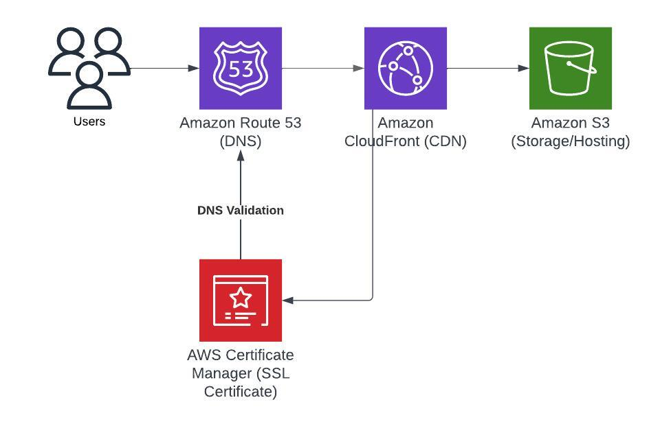

# Frontend Architecture

## Website Hosting Architecture

Components:

* S3: stores the actual website files
* CloudFront: Content Delivery Network - fetches files from S3 and serves them to users
* Route 53: DNS routing - routes traffic to the CloudFront distribution
* ACM: manages SSL certificate
 
## Thought process

### What do we need to deploy?

A website that serves documentation for ParlAI, an open-source project with 10.4k stars on GitHub. This appears to be a static website.

### What do we already have to work with?

- `website` directory with source code
- CircleCI pipeline, which already contains jobs to:
    - build the website
    - check for broken links
    - deploy the website by uploading it to S3
    - test the website by curling some pages

### What are we missing?

- IaC for S3 (and any other AWS resources)
- potentially some extra linting or testing; for example, spell checking docs

### Research/design thought process

As this is a static website, hosting the website could be as simple as just uploading the website to an S3 bucket and [enabling static website hosting](https://docs.aws.amazon.com/AmazonS3/latest/userguide/HostingWebsiteOnS3Setup.html). The "deploy" stage of the current pipeline just uploads the website to S3, so this indeed seems to be what the ParlAI maintainers are doing right now.

Do we need anything more complex than this?

In this case, I don't think so, as we're only serving a static website. There isn't really any business logic needed for this docs site; users don't interact with the site beyond accessing its content. S3 is stable and very cost-efficient (important for most open-source projects), so it is appropriate for this use case. To improve on what ParlAI is already doing with S3 hosting, we can stick with AWS and just add CloudFront in front of S3 to improve load time and security (among other benefits of using a CDN).

This should be a simple and cost-effective architecture for hosting a static website. CloudFront includes [10,000,000](https://aws.amazon.com/cloudfront/pricing/) HTTP/S requests in its free tier, and I wouldn't expect huge traffic for a docs site like this -- it could potentially even be covered by the free tier, being an archived project that likely has a few thousand remaining active users at most.

The biggest thing I see missing from the pipeline is support for IaC, so I'll add Terraform for IaC and update the CI pipeline to include steps to lint/validate/apply the Terraform. AWS CloudFormation would also be a good option here as we're setting up a simple stack of purely AWS resources. I'll go with Terraform because I'm personally more familiar with it, and I understand that it's often preferred over CloudFormation because it can be more flexible with different providers and supports more functions. However, it probably isn't much better than CloudFormation for this specific use case.

## Sources and implementation

I referenced AWS documentation on hosting static websites through S3 and CloudFront to understand how they work and link together.

To determine how to actually implement this architecture and include Route 53 and ACM for DNS and SSL, I heavily referenced this blog post and lifted much of my Terraform directly from here: https://www.alexhyett.com/terraform-s3-static-website-hosting/

I was debating whether or not to write the Terraform for this from scratch for the purposes of this exercise, but ultimately decided against it because if this was a real task I was assigned for work, I would have copied from a reference as a starting point as well. It's very common to use S3/CloudFront for static website hosting, and there's no reason to reinvent the wheel; using existing work as a base lets us get to a robust solution more quickly. However, I did modify the Terraform from this blog post to: (1) fit my usual Terraform project formatting, (2) put the AWS resource definitions into a module so that this could be reused if needed, and (3) update the Terraform and AWS provider versions to the latest. In particular, I refactored the S3 bucket code to replace deprecated configuration options.

Given more time, I would have given a lot more thought to and made necessary modifications to things like the DNS verification process (based on the domain provider), security configurations, certificates, CloudFront distribution configs, etc. However, with about 3 hours for this exercise, I left what was in the blog post as reasonable defaults for the time being.

Additionally, I referenced this documentation on how to run Terraform in a CircleCI pipeline: https://developer.hashicorp.com/terraform/tutorials/automation/circle-ci

I added an additional lint and validation job here, but otherwise mostly copied the jobs from here without too many modifications. Given a real CircleCI project to run the pipeline, I would have made more modifications to these templates based on testing. I also see that there is an [official Terraform orb](https://circleci.com/developer/orbs/orb/circleci/terraform), so I could have used that instead of these jobs from HashiCorp.

### Missing work & potential future improvements

Missing:

- An AWS account
- AWS credentials for the CircleCI project
- Terraform remote state setup
- Generally, the glue between various providers (CircleCI, Terraform/potentially Terraform cloud, AWS)
- Better security configuration for the AWS resources
- Improved testing
- Scripts

Potential improvements:

If this was a dynamic website instead of static, I probably would have used a three-tier architecture closer to this [web app example with AWS](https://docs.aws.amazon.com/whitepapers/latest/serverless-multi-tier-architectures-api-gateway-lambda/web-application.html) for more scalability instead, depending on how the app was already set up.

AWS Amplify could be another option for hosting the current static website, but since we already have a CI pipeline and this should be a lower traffic site, it doesn't seem worth the cost tradeoff versus hosting with S3.

## Challenges

Firstly, I've never used CircleCI before, so this syntax was totally new to me and I had to take some time to read docs and understand it. I mainly have experience with GitLab CI/CD.

I've also never had to set up infrastructure to host a website on the public Internet from scratch before, so this required some research to see what options there are and what would make the most sense for this use case (docs for an open source project). The closest thing I've done to this is setting up Kubernetes ingresses to be accessible on a company-internal VPN, or to services running in other AWS VPCs. As I've mostly worked with services running in Kubernetes, a lot of this hosting architecture has been abstracted away or handled automatically for me through services like external DNS and the nginx load balancer controller.

Because I needed to do a decent amount of research for this project, I had less time to spend on implementation, hence my decision to copy some Terraform instead of writing everything from scratch. Unfortunately, I also ran out of time to write any scripts, so I wasn't able to demonstrate my abilities there.

I don't think scripting would be strictly necessary for a bare-bones implementation of this simple web hosting architecture, but if I were to have added any scripts, I probably would have written two Python or bash scripts: one for linting/spellchecking the docs Markdown pages, and one for testing the website once deployed. They already have basic liveness tests and a check for broken links. This seems more or less sufficient for basic testing of a static website, but I could have tried to add load/performance tests, for instance. A good basic test also would have been to make sure that HTTP requests get redirected to HTTPS as intended.

Finally, I couldn't test that my pipeline and IaC were fully functional given that the pipeline changes were meant to be pseudocode, and I don't actually have an AWS environment set up to run my Terraform against. However, I did at least verify that the Terraform syntax was correct.
